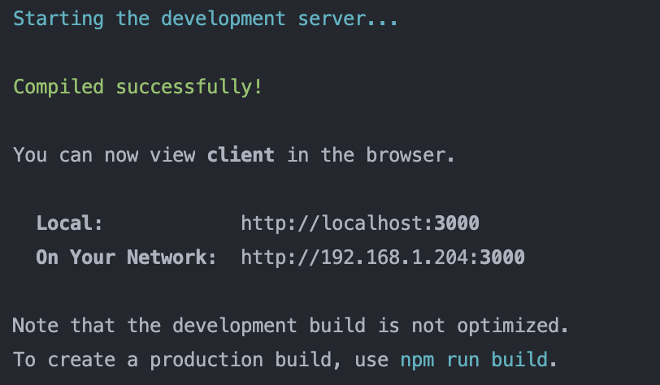
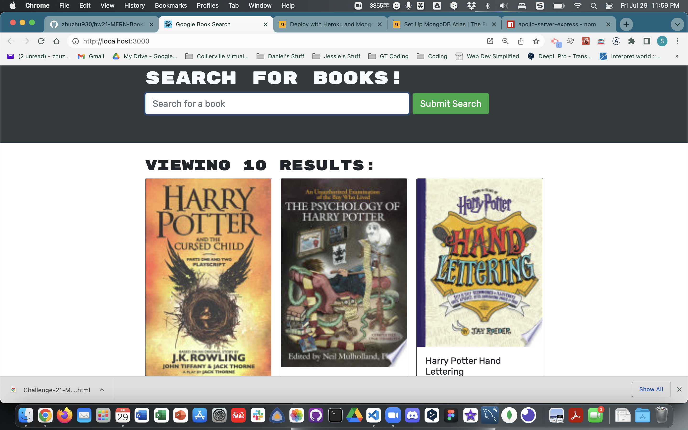
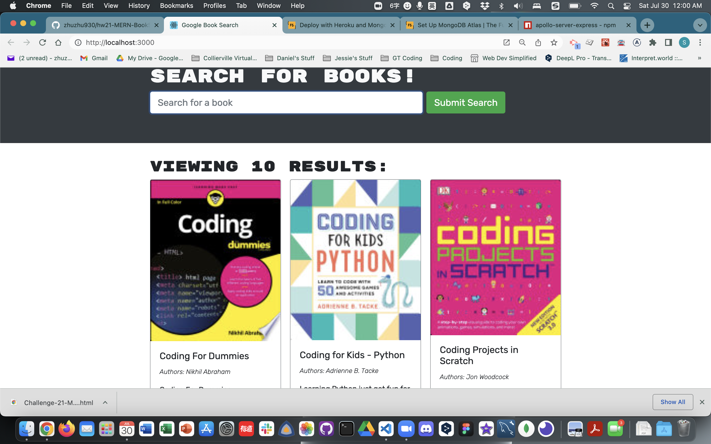
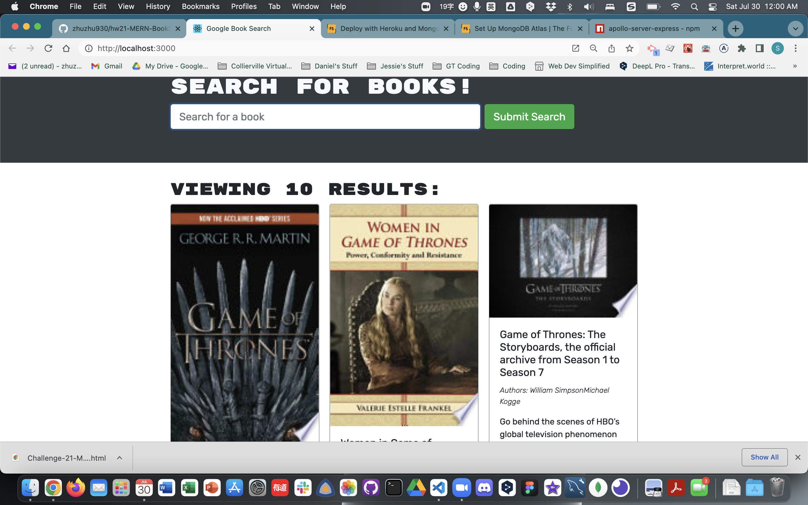

# MERN-BookSearchEngine

Designed by: Jessie Doherty

## Description

This a full-stack MERN app that is for searching books using Google Search Engine.

- What was your motivation?
- Answer: To study the full-stack website, and an interesting way to present books using a search engine.
- Why did you build this project?
- Answer: Build a cleaner interface to search for books, check the description and related links.
- What problem does it solve?
- Answer: A full stack app using MongoDB, Express.js, React.js and Node.js to present a cleaner interface for book searching.
- What did you learn?
- Answer: How to connect MongoDB, Express.js, React.js, Node.js, GraphQL, and Apollo Server.

## Installation

Please tell us the 3 simple steps for installing your app.

- Step 1: Run `npm install`.
- Step 2: Run `npm run develop`.
- Step 3: Check the Heroku deployment.

## Usage

- Screenshots of the App

  Terminal side:
  

  Localhost Page:

  - 
  - 
  - 

## License

    MIT License

    Copyright (c) 2022 Jessie Doherty

    Permission is hereby granted, free of charge, to any person obtaining a copy
    of this software and associated documentation files (the "Software"), to deal
    in the Software without restriction, including without limitation the rights
    to use, copy, modify, merge, publish, distribute, sublicense, and/or sell
    copies of the Software, and to permit persons to whom the Software is
    furnished to do so, subject to the following conditions:

    The above copyright notice and this permission notice shall be included in all
    copies or substantial portions of the Software.

    THE SOFTWARE IS PROVIDED "AS IS", WITHOUT WARRANTY OF ANY KIND, EXPRESS OR
    IMPLIED, INCLUDING BUT NOT LIMITED TO THE WARRANTIES OF MERCHANTABILITY,
    FITNESS FOR A PARTICULAR PURPOSE AND NONINFRINGEMENT. IN NO EVENT SHALL THE
    AUTHORS OR COPYRIGHT HOLDERS BE LIABLE FOR ANY CLAIM, DAMAGES OR OTHER
    LIABILITY, WHETHER IN AN ACTION OF CONTRACT, TORT OR OTHERWISE, ARISING FROM,
    OUT OF OR IN CONNECTION WITH THE SOFTWARE OR THE USE OR OTHER DEALINGS IN THE
    SOFTWARE.

    ---

## 🏆 Miscellaneous

## Badges

- 
- 

## Features

- Searching books in a cleaner and more direct interface.

## How to Contribute

- This repo is open for all collaborators free of charge.

## URLs

- [Repo URL](https://github.com/zhuzhu930/hw21-MERN-BookSearchEngine-JD)
- [Heroku URL](#)
